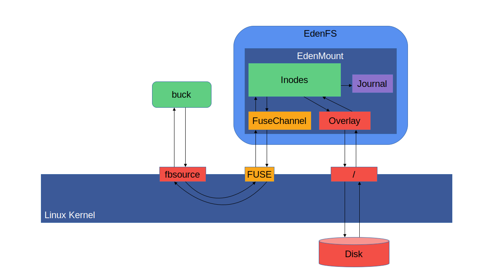
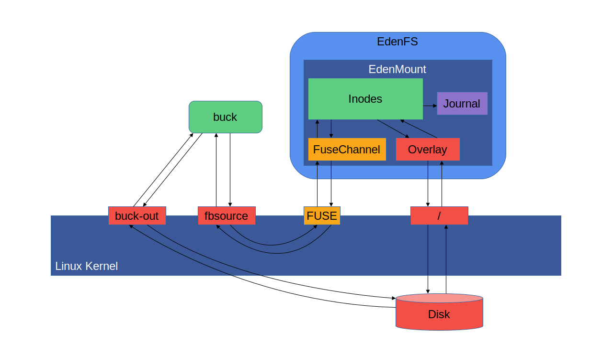

Redirections
============

EdenFS's main performance advantages come from lazily fetching data from source
control, which is beneficial when checking out and reading files checked in to
source control.  However, many applications also want to modify files inside the
checkout, or write new files.

Unfortunately these modifying I/O operations are usually slower when using
EdenFS, compared to writing directly to local disk.  This is because these I/O
operations have to traverse through the kernel multiple times, instead of just
once.

When writing to a normal on-disk filesystem, the I/O operation is normally
handled directly in the kernel, which will store the data to disk.  However,
when writing to an EdenFS mount point the kernel must send the I/O request to
EdenFS.  EdenFS will then perform the write operation by updating the
corresponding file in its overlay.  The overlay state is stored on local disk,
so this requires a separate I/O operation to the kernel, which will write the
overlay data to disk.  Once the I/O operation is done, EdenFS records the I/O
operation its journal before responding to the FUSE request so that the kernel
can complete the initial I/O operation that triggered this entire chain of
events.

These extra hops from the kernel to EdenFS and then back to the kernel add
overhead.  This generally makes it preferable to avoid performing large amounts
of write I/O in an EdenFS checkout whenever possible.

Unfortunately many build tools and existing user programs expect to be able to
write output files directly into specific directories inside a checkout.  For
instance, [Buck](https://buck.build/) normally prefers to keep its build output
in a directory named `buck-out` inside the top-level source directory.  A build
operation can generate many thousands of files, containing many gigabytes of
data.

In order to make it easier to use EdenFS with these tools, EdenFS provides a
mechanism to allow specific subdirectories to bypass EdenFS, and be stored
directly on local disk.  The only caveat is that the redirected subdirectories
must be new subdirectories that only contain generated files, and do not
contain any files tracked in source control.

The set of redirected subdirectories can be controlled through the
`edenfsctl redirect` subcommand, or through a special `.eden-redirections`
configuration file in the top-level directory of the repository.  Each time a
new commit is checked out the `.eden-redirections` file is parsed and the
current set of redirected directories is updated appropriately.

Directory redirection is implemented slightly differently on different
platforms, but the configuration mechanism is the same across all platforms.
On Linux redirections are primarily implemented using bind mounts, where a
local disk subdirectory is bind-mounted on top of the desired subdirectory in
the EdenFS checkout.  Directory redirections can also be implemented using
symlinks, although this has some drawbacks compared to bind mounts,
particularly around the behavior of referring to `..` when inside the symlink
directory.

The `Buck` build tool will automatically detect if it is being used inside of
an EdenFS checkout, and will configure a redirection for the `buck-out`
directory.  This allows all generated build output to be written directly to
local disk, avoiding going through EdenFS.

Note that this does mean that all write operations inside the `buck-out`
subdirectory also bypass the EdenFS journal, and therefore cannot be reported
to subscribers through [Watchman](https://facebook.github.io/watchman/).
However, in most situations this is generally desirable: there is a high amount
of write I/O traffic to the build output directory during builds, and most
filesystem subscribers are not interested in these update events and want to
avoid the overhead if receiving these updates.  Even in non-EdenFS checkouts
Watchman is typically configured to avoid watching build output directories
when possible.
